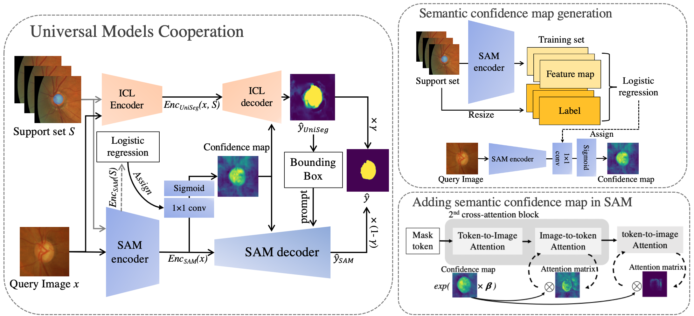
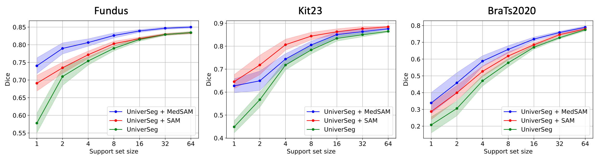

# I-SAM: Segmentation by Synergizing In-Context Learning model and SAM

## Introduction
I-SAM presents a cutting-edge approach to image segmentation by leveraging in-context learning, capable of accurately segmenting new images after being provided with a few annotated examples. Our method integrates the strengths of [UniverSeg](https://github.com/JJGO/UniverSeg/tree/main) and the Segment Anything Model (SAM), facilitating a robust segmentation performance with minimal manual effort.

<div align="center">
   <br>
</div>

<div align="center">
   <br>
</div>

Our method combines the advantages of the UniverSeg model and the SAM model to establish a method that performs well under the in-context learning paradigm. We evaluated our method in 3 different types of data sets, and the results showed that our method can greatly improve previous in-context learning model especially when the support set is small.  

## Requirements
Setting up the environment for I-SAM is straightforward. Use the following commands to create and activate the necessary environment:

```bash
conda create -n persam python=3.8
conda activate UniSAM

pip install -r requirements.txt
```

I-SAM's code requires pytorch>=1.7 and torchvision>=0.8. Please follow the instructions [here](https://pytorch.org/get-started/locally/) to install both PyTorch and TorchVision dependencies.

## Download Checkpoints
Before getting started, download the checkpoints for SAM or MedSAM:

- [SAM ViT-b Checkpoint](https://dl.fbaipublicfiles.com/segment_anything/sam_vit_b_01ec64.pth)
- [MedSAM Checkpoint](https://drive.google.com/drive/folders/1ETWmi4AiniJeWOt6HAsYgTjYv_fkgzoN?usp=drive_link)  
Place the downloaded checkpoints in the `checkpoints` directory within the project structure.

## Getting Started
To run I-SAM, open the `I-SAM_example.ipynb` notebook and follow the step-by-step instructions. The notebook will guide you through the process of using our model.

## Acknowledgements
This repository benefits from the excellent work provided by [UniverSeg](https://github.com/JJGO/UniverSeg/tree/main) and [Personalize-SAM](https://github.com/ZrrSkywalker/Personalize-SAM). We extend our gratitude for their significant contributions to the field.


